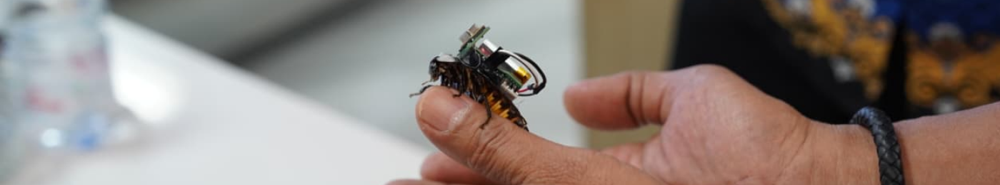

<p align="center">
  
</p>

<h1 align="center">Cyroach — Real-Time Cyborg Monitoring Dashboard</h1>

<p align="center">
  A real-time web dashboard for visualizing thermal-camera and navigation-sensor data streamed from an ESP32-C6-equipped cyborg cockroach.
  <br>Built as an Undergraduate Thesis project — Electrical Engineering, Universitas Diponegoro.
</p>

<p align="center">
  
  
  
  
</p>

---

## About

Cyroach is a real-time web monitoring system built for a biobotics research project: a cockroach fitted with a lightweight sensor backpack (thermal camera + navigation/motion sensors) sends live telemetry over Wi-Fi to this dashboard, where it's visualized as thermal heatmaps and movement trajectories.

The system was designed to let researchers observe a "mission", a live exploration run, in real time from a browser, then review the recorded data afterward, including exportable PDF mission reports.

**Key results**
- 9 REST API endpoints connecting the ESP32-C6 hardware to the dashboard
- ~211.6 ms average data transmission latency, end to end
- Real-time channel updates via Pusher, no manual refresh needed

## Features

- 📡 **Live device telemetry** ingest sensor readings (thermal + position) from the ESP32-C6 over a REST endpoint
- 🔴 **Real-time dashboard** WebSocket-powered live view of the current mission via Pusher channels
- 🗺️ **Trajectory mapping & thermal heatmap** rendered with the HTML5 Canvas API
- 🧭 **Mission history** browse past missions and drill into a specific run's detail page
- 📄 **PDF export** generate a shareable mission report straight from the dashboard
- 👀 **Active viewer counter** see how many people are watching a mission live

## Tech Stack

| Layer | Technology |
|---|---|
| Backend | Laravel 13 (PHP) |
| Database | MySQL |
| Real-time | Pusher (WebSocket channels) |
| Hardware | ESP32-C6 (thermal camera + navigation sensors) |
| Frontend rendering | HTML5 Canvas API |

## Getting Started

### Prerequisites
- PHP 8.2+
- Composer
- Node.js & npm
- MySQL
- A [Pusher](https://pusher.com) account (or compatible WebSocket driver) for real-time channels

### Installation

```bash
# 1. Clone the repository
git clone https://github.com/mridwanslamat/cyroach-web.git
cd cyroach-web

# 2. Install dependencies
composer install
npm install

# 3. Configure environment
cp .env.example .env
php artisan key:generate
# → fill in DB_* and PUSHER_* credentials in .env

# 4. Run migrations
php artisan migrate

# 5. Build frontend assets
npm run build

# 6. Serve the app
php artisan serve
```

The dashboard will be available at `http://localhost:8000`.

### Sending sensor data (ESP32-C6)

The hardware posts readings to:

```
POST /api/sensor-data
POST /api/end-mission
```

See `routes/api.php` for the full list of endpoints, including mission listing, live device status, and trajectory retrieval.

## Project Structure

```
app/
 ├─ Http/Controllers/Api/   # Sensor, Mission, Device API controllers
 ├─ Http/Controllers/       # Mission PDF export controller
 ├─ Models/                 # Detection, Device, Mission, Notification, SensorData, User
 └─ Events/                 # Real-time broadcast events
resources/views/            # Dashboard, missions list & detail, about pages
routes/
 ├─ web.php                 # Dashboard routes + broadcasting auth
 └─ api.php                 # Sensor ingestion & mission API
```

## Author

**Muhammad Ridwan Slamat**
Electrical Engineering, Universitas Diponegoro
[LinkedIn](https://linkedin.com/in/ridwanslamat/) · [mridwans466@gmail.com](mailto:mridwans466@gmail.com)

---
<sub>Built on the Laravel framework.</sub>
